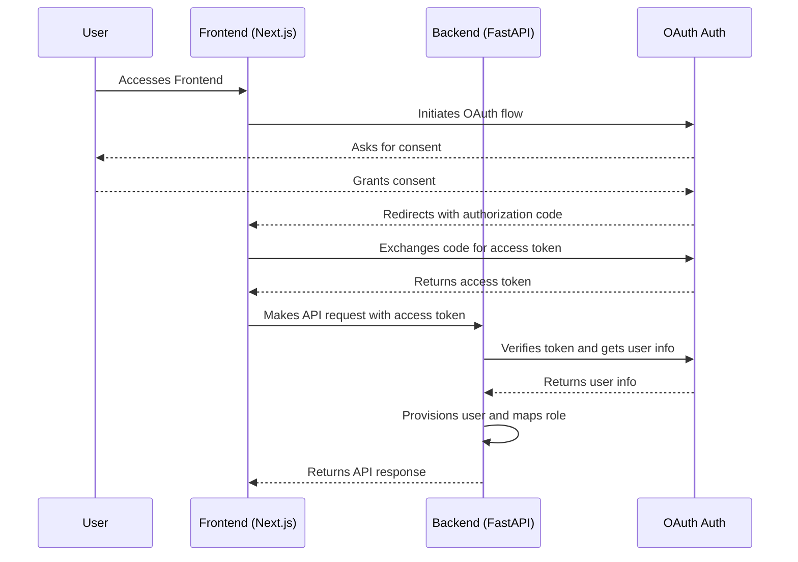

This document outlines the architecture of the OAuth-based authentication and user provisioning system in Keep. It is intended for developers who need to maintain or extend the authentication functionality.

## Overview

The authentication system is designed to be generic and support multiple OAuth providers. It leverages NextAuth.js on the frontend and a custom verification mechanism on the backend. The key features are:

-   **Provider-agnostic:** The core logic is not tied to any specific OAuth provider.
-   **Auto-provisioning:** Users are automatically created in the Keep database upon their first successful login, and existing users' roles are updated to match the current role mapping configuration.
-   **Role-based access control (RBAC):** User roles are determined by their email address based on a configurable mapping.

## Architecture

The authentication flow involves the frontend, the backend, and the external OAuth provider.



### Frontend

The frontend is a Next.js application that uses the `next-auth` library to handle the complexities of the OAuth flow.

-   **`auth.config.ts`**: This file configures the OAuth providers. It dynamically selects the provider based on the `AUTH_PROVIDER` environment variable. This is where you would add new providers like Google, etc.
-   **`SignInForm.tsx`**: This component renders the sign-in button and initiates the sign-in process using the `signIn` function from `next-auth`.
-   **`[...nextauth]/route.ts` (Implicit):** This is the NextAuth.js API route that handles the OAuth callbacks, token exchange, and session management. The access token from the provider is passed to the Keep backend in API requests.

### Backend

The backend is a FastAPI application that validates the access token and handles user management.

-   **`identitymanager/identity_managers/oauth/oauth_identitymanager.py`**: This is the main entry point for OAuth identity management. It uses the `OAuthVerifier`.
-   **`identitymanager/identity_managers/oauth/oauth_authverifier.py`**: This is the core of the backend authentication logic.
    -   The `OAuthVerifier` class receives the access token from the frontend in the `Authorization` header.
    -   It calls the `get_user_info` function, which fetches user details from the OAuth provider's API (e.g., GitHub or Azure AD).
    -   It uses the `RoleMapper` to determine the user's role based on their email address.
    -   It performs auto-provisioning by creating a new user in the database if one does not already exist, or updates the existing user's role if it has changed in the role mapping configuration.
    -   It checks if the user's role has the required permissions for the requested API endpoint.

### Role-Based Access Control (RBAC)

RBAC is managed by the `RoleMapper` class in `keep/identitymanager/role_mapper.py`.

-   The `RoleMapper` loads a YAML file defined by the `KEEP_ROLE_MAPPING_FILE` environment variable.
-   This file maps email addresses or wildcard patterns to Keep roles.
-   If a user's email doesn't match any pattern, they are assigned a default role defined by `KEEP_ROLE_MAPPING_DEFAULT_ROLE`.

Here is an example of a role mapping file:

```yaml
role_mappings:
  admin:
    - "admin@example.com"
    - "*@my-company.com"
  viewer:
    - "viewer@example.com"
  noc:
    - "*" # Default role for everyone else
```

## Adding a New Provider

To add a new OAuth provider, you need to make changes in both the frontend and backend.

1.  **Frontend (`auth.config.ts`):**
    -   Add the new provider from `next-auth/providers`.
    -   Add a new condition to the `[AuthType.OAUTH]` configuration to handle the new provider based on the `AUTH_PROVIDER` environment variable.
    -   Add the necessary environment variables for the new provider's client ID and secret.

2.  **Backend (`oauth_authverifier.py`):**
    -   Add a new condition to the `get_user_info` function to handle the new provider.
    -   Implement the logic to call the new provider's user info API endpoint and extract the user's email and name.

This generic approach ensures that the core authentication and user management logic remains the same, and only provider-specific details need to be added.