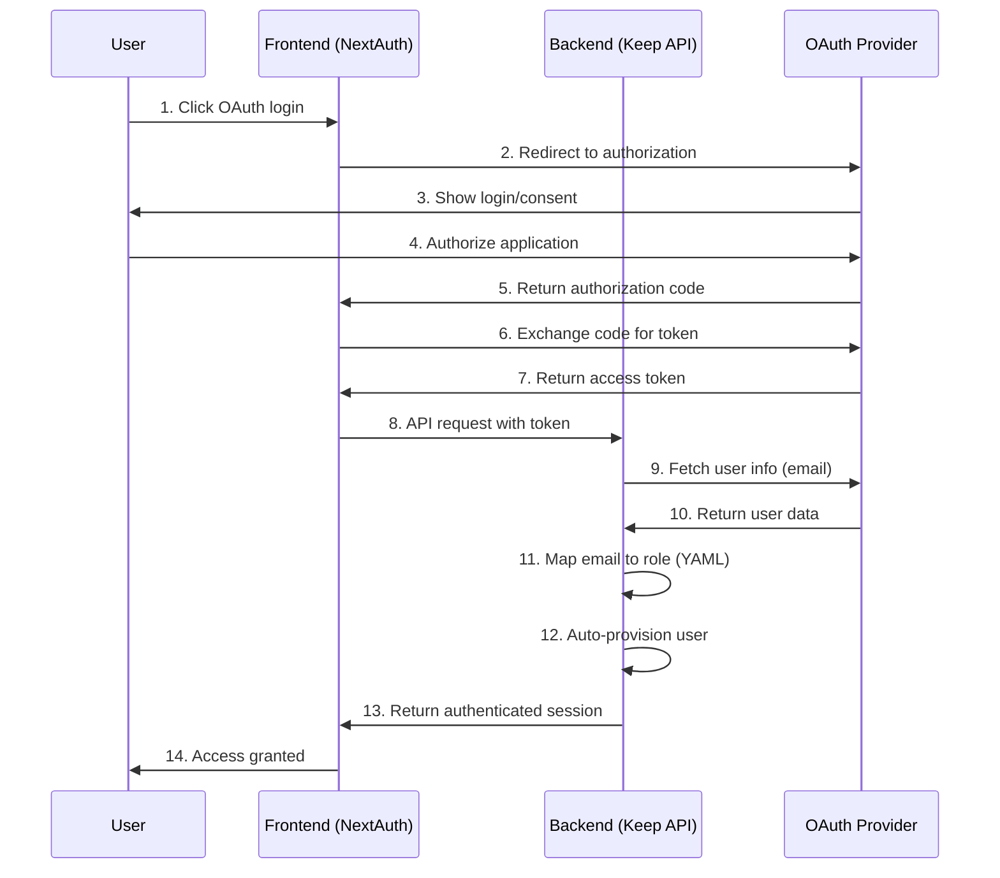

## Overview

OAuth authentication in Keep allows users to authenticate using external OAuth 2.0 providers while maintaining Keep's role-based access control and user management. This implementation uses NextAuth.js v5 for frontend OAuth handling and Keep's backend for user provisioning and role management.

## Architecture

### Priority-Based Authentication

Keep follows a priority-based authentication approach in the `AuthVerifierBase` class:

1. **Bearer Token**: OAuth/JWT tokens are verified first if present
2. **API Key**: API key authentication is used if no bearer token is present
3. **HTTP Basic Auth**: Fallback authentication method

This priority is universal across all authentication types (OAuth, Auth0, Azure AD, DB, etc.) as they all inherit from `AuthVerifierBase`.

### OAuth-Specific Architecture

```
┌─────────────────┐    ┌─────────────────┐    ┌─────────────────┐
│   Frontend      │    │   Backend       │    │ OAuth Provider  │
│   (NextAuth)    │    │   (Keep API)    │    │   (Any OAuth)   │
└─────────────────┘    └─────────────────┘    └─────────────────┘
         │                       │                       │
    OAuth Flow              Token + User Info         User Info API
         │                       │                       │
         │◀─────────────────────▶│◀─────────────────────▶│
         │                       │                       │
         ▼                       ▼                       │
┌─────────────────┐    ┌─────────────────┐              │
│ Session Storage │    │ User Database   │              │
│ (Browser)       │    │ Role Mapping    │              │
└─────────────────┘    └─────────────────┘              │
```

### Component Responsibilities

| Component | Responsibility |
|-----------|----------------|
| **Frontend (NextAuth)** | OAuth 2.0 authorization flow, token management, session storage |
| **Backend (Keep API)** | User info fetching, role mapping, user provisioning, RBAC enforcement |
| **OAuth Provider** | User authentication, authorization, user info API |
| **YAML Config** | Email-to-role mappings, access control definitions |

### Backend Implementation Details

#### Token Handling
The backend `OauthAuthVerifier` handles OAuth provider access tokens:

- **OAuth Provider Access Tokens**: Raw access tokens from any OAuth 2.0 provider
- **Provider Configuration**: Explicitly configured via `KEEP_OAUTH_PROVIDER` environment variable
- **NextAuth Integration**: NextAuth passes the OAuth access token directly to the backend

#### Provider API Integration
The backend fetches user information using provider-specific user info APIs:

- **User Info Endpoint**: Each OAuth provider exposes a user information API endpoint
- **Email Extraction**: Extracts user email from the provider's user info response
- **Fallback Logic**: Multiple email field sources with fallback mechanisms
- **Extensible Design**: Easy to add new providers by implementing their user info API calls

#### Role Mapping System
The `OAuthUserRoleManager` handles email-to-role mappings:

1. **Exact Match**: Direct email matching (highest priority)
2. **Pattern Match**: Wildcard patterns using `fnmatch` (e.g., `*@admin.company.com`)
3. **Default Fallback**: `KEEP_OAUTH_DEFAULT_ROLE` environment variable

#### Auto-Provisioning
- **User Creation**: Automatic user creation on first login
- **Role Assignment**: Based on email mapping or default role
- **Session Tracking**: Prevents duplicate operations using token hashing
- **Last Login Updates**: Tracks user activity

#### Security Features
- **Scope Validation**: Role-based scope checking via RBAC
- **Token Deduplication**: Hash-based token tracking to prevent replay
- **Provider Validation**: Strict provider API response validation
- **Email Verification**: Multiple email sources with fallback logic

### Frontend Implementation Details

#### NextAuth.js v5 Configuration
The frontend uses NextAuth's official OAuth providers:

**Provider Architecture:**
- **Dynamic Selection**: Provider chosen via `KEEP_OAUTH_PROVIDER` environment variable
- **Official Providers**: Uses NextAuth's built-in, battle-tested OAuth providers
- **Environment-Based Config**: Client credentials configured via environment variables
- **Extensible Design**: Easy to add new providers using NextAuth's provider ecosystem

**Configuration Pattern:**
```javascript
// Dynamic provider selection based on KEEP_OAUTH_PROVIDER
const oauthProvider = process.env.KEEP_OAUTH_PROVIDER?.toLowerCase();

// Example provider configurations:
if (oauthProvider === "github") {
  return [GitHub({
    clientId: process.env.KEEP_OAUTH_GITHUB_CLIENT_ID!,
    clientSecret: process.env.KEEP_OAUTH_GITHUB_CLIENT_SECRET!,
  })];
} else if (oauthProvider === "azuread") {
  return [MicrosoftEntraID({
    clientId: process.env.KEEP_OAUTH_AZUREAD_CLIENT_ID!,
    clientSecret: process.env.KEEP_OAUTH_AZUREAD_CLIENT_SECRET!,
    issuer: `https://login.microsoftonline.com/${tenantId}/v2.0`,
  })];
}

// Pattern for adding new providers:
// - Import NextAuth provider: import { NewProvider } from "next-auth/providers/newprovider"
// - Add environment variables: KEEP_OAUTH_NEWPROVIDER_CLIENT_ID, KEEP_OAUTH_NEWPROVIDER_CLIENT_SECRET
// - Add configuration block following the same pattern above
```

#### Session Management
- **JWT Callbacks**: Handle token and session data flow
- **Access Token Storage**: OAuth access tokens stored in NextAuth session
- **Tenant Assignment**: Default tenant "keep" for OAuth users
- **Role Delegation**: Role determination delegated to backend

### Authentication Flow


```mermaid
sequenceDiagram
    participant User
    participant Frontend as Frontend (NextAuth)
    participant Backend as Backend (Keep API)
    participant Provider as OAuth Provider

    User->>Frontend: 1. Click OAuth login
    Frontend->>Provider: 2. Redirect to authorization
    Provider->>User: 3. Show login/consent
    User->>Provider: 4. Authorize application
    Provider->>Frontend: 5. Return authorization code
    Frontend->>Provider: 6. Exchange code for token
    Provider->>Frontend: 7. Return access token
    Frontend->>Backend: 8. API request with token
    Backend->>Provider: 9. Fetch user info (email)
    Provider->>Backend: 10. Return user data
    Backend->>Backend: 11. Map email to role (YAML)
    Backend->>Backend: 12. Auto-provision user
    Backend->>Frontend: 13. Return authenticated session
    Frontend->>User: 14. Access granted
```

## Configuration

### Environment Configuration

Set up your environment variables:

```bash
# Authentication type
AUTH_TYPE=oauth

# OAuth Provider Configuration
# Specify a single provider: github or azuread
KEEP_OAUTH_PROVIDER=github

# Auto-provision users on first login (true/false)
KEEP_OAUTH_AUTO_PROVISION=true

# Default role for new users
KEEP_OAUTH_DEFAULT_ROLE=noc

# Optional: Path to role mappings file
KEEP_OAUTH_ROLE_MAPPING_FILE=/path/to/oauth-role-mappings.yaml

# NextAuth Configuration (required for frontend)
NEXTAUTH_URL=http://localhost:3000
NEXTAUTH_SECRET=your_nextauth_secret_key_here

# Optional: Debug mode
AUTH_DEBUG=true
```

### Provider-Specific Configuration

Configure your chosen OAuth provider with its credentials:

**GitHub Provider (if KEEP_OAUTH_PROVIDER=github):**
```bash
# GitHub OAuth Configuration
KEEP_OAUTH_GITHUB_CLIENT_ID=your_github_client_id
KEEP_OAUTH_GITHUB_CLIENT_SECRET=your_github_client_secret
```

**Azure AD Provider (if KEEP_OAUTH_PROVIDER=azuread):**
```bash
# Azure AD OAuth Configuration
KEEP_OAUTH_AZUREAD_CLIENT_ID=your_azuread_client_id
KEEP_OAUTH_AZUREAD_CLIENT_SECRET=your_azuread_client_secret
KEEP_OAUTH_AZUREAD_TENANT_ID=your_azure_ad_tenant_id
```

### Frontend Configuration

The frontend uses the same environment variables as the backend for the chosen provider.

### User Role Management

Create a YAML file to define role-to-users mappings:

```yaml
# oauth-role-mappings.yaml
# OAuth Role Mappings Configuration for Keep
# This file maps OAuth users to Keep roles

role_mappings:
  # Admin users - full system access
  admin:
    - admin@yourcompany.com
    - cto@yourcompany.com
    - platform-lead@yourcompany.com
    - security-admin@yourcompany.com
    - devops-lead@yourcompany.com
    # Pattern-based mappings (use * for wildcards)
    - "*@admin.yourcompany.com"  # All users from admin subdomain
    - "admin-*@yourcompany.com"  # All admin-prefixed users
  
  # NOC users - monitoring and response team
  noc:
    - ops-team@yourcompany.com
    - sre-team@yourcompany.com
    - devops@yourcompany.com
    - monitoring@yourcompany.com
    - incident-response@yourcompany.com
    - engineer@yourcompany.com
    - oncall@yourcompany.com
    - support@yourcompany.com
    # Pattern-based mappings
    - "*@ops.yourcompany.com"      # All users from ops subdomain
    - "*@monitoring.yourcompany.com"  # All users from monitoring domain
    - "noc-*@yourcompany.com"      # All NOC-prefixed users
  
  # Service accounts for webhooks
  webhook:
    - webhooks@yourcompany.com
    - automation@yourcompany.com
    - alerts-service@yourcompany.com
    - monitoring-system@yourcompany.com
    - alert-ingestion@yourcompany.com
    # Pattern-based mappings
    - "*-service@yourcompany.com"  # All service accounts
    - "*-alerts@yourcompany.com"   # All alert services
    - "webhook-*@yourcompany.com"  # All webhook-prefixed accounts
  
  # Service accounts for workflow execution
  workflowrunner:
    - workflow-runner@yourcompany.com
    - automation-workflows@yourcompany.com
    - workflow-service@yourcompany.com
    # Pattern-based mappings
    - "workflow-*@yourcompany.com"  # All workflow-prefixed accounts
    - "*-workflow@yourcompany.com"  # All workflow-suffixed accounts

# Available Keep roles:
# - admin: Full administrative access to Keep
# - noc: Read access, alert management, incident response
# - webhook: API access for sending alerts and webhook data
# - workflowrunner: Execute workflows via API
#
# Role matching rules:
# 1. Exact email match (highest priority)
# 2. Pattern match using wildcards (* matches any characters)
# 3. KEEP_OAUTH_DEFAULT_ROLE environment variable (fallback)
#
# Pattern matching:
# - Use * as wildcard for any characters
# - Patterns are case-insensitive
# - First matching role is used (order matters within each role)
# - More specific patterns should be listed before general ones
#
# Role reconciliation:
# - Mappings are loaded once at backend startup
# - Fresh role calculation on user first login (creation)
# - Cached for performance on subsequent logins
# - Invalid roles will fall back to default role with warning logged
```

**Role Matching Priority:**
1. **Exact Match**: Check for exact email matches in any role's user list (highest priority)
2. **Pattern Match**: Apply wildcard patterns using `*` for any characters
3. **Environment Fallback**: Use `KEEP_OAUTH_DEFAULT_ROLE` if no matches found

**Role Reconciliation Strategy:**
- **At Backend Startup**: Role mappings are loaded once from YAML file
- **At User First Login**: Fresh role calculation when user is created for the first time
- **Subsequent Logins**: Cached role is used for performance
- **No Hot Reloading**: YAML changes require pod restart (suitable for containerized deployments)

**Available Roles:**

| Role | Description | Permissions |
|------|-------------|-------------|
| `admin` | Full administrative access | All operations including user management, system configuration |
| `noc` | Network Operations Center | Read access, alert management, incident response |
| `webhook` | Service account role | API access for sending alerts and webhook data |
| `workflowrunner` | Workflow execution | Execute workflows via API |

## Provider Setup

### GitHub OAuth App

1. Go to GitHub → Settings → Developer settings → OAuth Apps
2. Create a new OAuth App with:
   - **Authorization callback URL**: `https://your-domain.com/api/auth/callback/github`
   - **Client ID**: Use for `KEEP_OAUTH_GITHUB_CLIENT_ID`
   - **Client Secret**: Use for `KEEP_OAUTH_GITHUB_CLIENT_SECRET`

### Azure AD App Registration

1. Go to Azure Portal → Azure Active Directory → App registrations
2. Create a new registration with:
   - **Redirect URI**: `https://your-domain.com/api/auth/callback/azuread`
3. In your App registration, note the following:
   - **Application (client) ID**: Use for `KEEP_OAUTH_AZUREAD_CLIENT_ID`
   - **Directory (tenant) ID**: Use this to construct the `KEEP_OAUTH_AZUREAD_ISSUER` URL.
4. Create a **Client Secret** and use its value for `KEEP_OAUTH_AZUREAD_CLIENT_SECRET`.

3. Configure API permissions:
   - Microsoft Graph → User.Read (delegated)
   - Grant admin consent

## Configuration

## Example Configuration

### Docker Compose Example

This example shows how to configure the services using environment variables from a `.env` file.

```yaml
version: '3.8'
services:
  keep-backend:
    environment:
      # --- General Auth Config ---
      - AUTH_TYPE=oauth
      - KEEP_OAUTH_PROVIDER=${KEEP_OAUTH_PROVIDER}
      - KEEP_OAUTH_AUTO_PROVISION=true
      - KEEP_OAUTH_DEFAULT_ROLE=noc
      - KEEP_OAUTH_ROLE_MAPPING_FILE=/app/config/role-mappings.yaml

      # --- Provider Specific - Pass from .env ---
      # GitHub
      - KEEP_OAUTH_GITHUB_CLIENT_ID=${KEEP_OAUTH_GITHUB_CLIENT_ID}
      - KEEP_OAUTH_GITHUB_CLIENT_SECRET=${KEEP_OAUTH_GITHUB_CLIENT_SECRET}
      # Azure AD
      - KEEP_OAUTH_AZUREAD_CLIENT_ID=${KEEP_OAUTH_AZUREAD_CLIENT_ID}
      - KEEP_OAUTH_AZUREAD_CLIENT_SECRET=${KEEP_OAUTH_AZUREAD_CLIENT_SECRET}
      - KEEP_OAUTH_AZUREAD_TENANT_ID=${KEEP_OAUTH_AZUREAD_TENANT_ID}
    volumes:
      - ./role-mappings.yaml:/app/config/role-mappings.yaml:ro

  keep-frontend:
    environment:
      # --- General Auth Config ---
      - AUTH_TYPE=oauth
      - KEEP_OAUTH_PROVIDER=${KEEP_OAUTH_PROVIDER}
      - NEXTAUTH_URL=http://localhost:3000
      - NEXTAUTH_SECRET=${NEXTAUTH_SECRET}

      # --- Provider Specific - Pass from .env ---
      # GitHub
      - KEEP_OAUTH_GITHUB_CLIENT_ID=${KEEP_OAUTH_GITHUB_CLIENT_ID}
      - KEEP_OAUTH_GITHUB_CLIENT_SECRET=${KEEP_OAUTH_GITHUB_CLIENT_SECRET}
      # Azure AD
      - KEEP_OAUTH_AZUREAD_CLIENT_ID=${KEEP_OAUTH_AZUREAD_CLIENT_ID}
      - KEEP_OAUTH_AZUREAD_CLIENT_SECRET=${KEEP_OAUTH_AZUREAD_CLIENT_SECRET}
      - KEEP_OAUTH_AZUREAD_TENANT_ID=${KEEP_OAUTH_AZUREAD_TENANT_ID}
```

### Environment Variables (.env)

Create a `.env` file with the variables for your chosen provider.

**Example for GitHub:**
```bash
# --- General Auth Config ---
KEEP_OAUTH_PROVIDER=github
NEXTAUTH_SECRET=your_random_secret_key_here

# --- GitHub Credentials ---
KEEP_OAUTH_GITHUB_CLIENT_ID=your_github_client_id_here
KEEP_OAUTH_GITHUB_CLIENT_SECRET=your_github_client_secret_here
```

**Example for Azure AD:**
```bash
# --- General Auth Config ---
KEEP_OAUTH_PROVIDER=azuread
NEXTAUTH_SECRET=your_random_secret_key_here

# --- Azure AD Credentials ---
KEEP_OAUTH_AZUREAD_CLIENT_ID=your_azuread_client_id_here
KEEP_OAUTH_AZUREAD_CLIENT_SECRET=your_azuread_client_secret_here
KEEP_OAUTH_AZUREAD_TENANT_ID=your_azure_ad_tenant_id_here
```

### Role Mappings File Example

Create a `role-mappings.yaml` file to define role-to-users mappings:

```yaml
# role-mappings.yaml - OAuth Role Mappings for Keep
# This file defines which users belong to which Keep roles

role_mappings:
  # Admin users - full system access
  admin:
    - admin@yourcompany.com
    - cto@yourcompany.com
    - platform-lead@yourcompany.com
    - security-admin@yourcompany.com
    - devops-lead@yourcompany.com
    # Pattern-based mappings (use * for wildcards)
    - "*@admin.yourcompany.com"  # All users from admin subdomain
    - "admin-*@yourcompany.com"  # All admin-prefixed users
  
  # NOC users - monitoring and response team
  noc:
    - ops-team@yourcompany.com
    - sre-team@yourcompany.com
    - devops@yourcompany.com
    - monitoring@yourcompany.com
    - incident-response@yourcompany.com
    - engineer@yourcompany.com
    - oncall@yourcompany.com
    - support@yourcompany.com
    # Pattern-based mappings
    - "*@ops.yourcompany.com"      # All users from ops subdomain
    - "*@monitoring.yourcompany.com"  # All users from monitoring domain
    - "noc-*@yourcompany.com"      # All NOC-prefixed users
  
  # Service accounts for webhooks
  webhook:
    - webhooks@yourcompany.com
    - automation@yourcompany.com
    - alerts-service@yourcompany.com
    - monitoring-system@yourcompany.com
    - alert-ingestion@yourcompany.com
    # Pattern-based mappings
    - "*-service@yourcompany.com"  # All service accounts
    - "*-alerts@yourcompany.com"   # All alert services
    - "webhook-*@yourcompany.com"  # All webhook-prefixed accounts
  
  # Service accounts for workflow execution
  workflowrunner:
    - workflow-runner@yourcompany.com
    - automation-workflows@yourcompany.com
    - workflow-service@yourcompany.com
    # Pattern-based mappings
    - "workflow-*@yourcompany.com"  # All workflow-prefixed accounts
    - "*-workflow@yourcompany.com"  # All workflow-suffixed accounts

# Available Keep roles:
# - admin: Full administrative access to Keep
# - noc: Read access, alert management, incident response
# - webhook: API access for sending alerts and webhook data
# - workflowrunner: Execute workflows via API
#
# Role matching rules:
# 1. Exact email match (highest priority)
# 2. Pattern match using wildcards (* matches any characters)
# 3. KEEP_OAUTH_DEFAULT_ROLE environment variable (fallback)
#
# Pattern matching:
# - Use * as wildcard for any characters
# - Patterns are case-insensitive
# - First matching role is used (order matters within each role)
# - More specific patterns should be listed before general ones
#
# File monitoring:
# - Changes are detected automatically every 5 minutes
# - No restart required for role changes to take effect
# - Invalid roles will fall back to default role with warning logged
# - Results are cached for performance
```

The system will:
1. **Exact Match**: Check for exact email matches in any role's user list (highest priority)
2. **Pattern Match**: Apply wildcard patterns using `*` for any characters
3. **Environment Fallback**: Use `KEEP_OAUTH_DEFAULT_ROLE` if no matches found

#### Role Descriptions

| Role | Description | Permissions |
|------|-------------|-------------|
| `admin` | Full administrative access | All operations including user management, system configuration |
| `noc` | Network Operations Center | Read access, alert management, incident response |
| `webhook` | Service account role | API access for sending alerts and webhook data |
| `workflowrunner` | Workflow execution | Execute workflows via API |

## Security Considerations

- **Token Validation**: All OAuth tokens are cryptographically verified using provider's public keys
- **Role Validation**: User roles are validated on each request against the YAML file
- **Scope Limitation**: Minimal scopes are requested from OAuth providers (user profile only)
- **Secure Configuration**: All secrets are configured via environment variables
- **Auto-Provisioning**: Users are created with minimal permissions by default
- **Session Security**: Sessions use secure, HTTP-only cookies with CSRF protection

## Troubleshooting

### General OAuth Issues

**"Invalid OAuth provider" error:**
- Check that the provider is set correctly in `KEEP_OAUTH_PROVIDER`
- Verify environment variables are set correctly for your chosen provider
- Confirm OAuth app configuration in provider console

**"User role not found" error:**
- Check user email exists in the oauth-role-mappings.yaml file
- Verify the YAML file path is correct and accessible
- Ensure default role is configured with `KEEP_OAUTH_DEFAULT_ROLE`

**"Provider configuration not found" error:**
- Verify all required environment variables are set for the provider
- Restart the application after configuration changes

**OAuth app redirect URI mismatch:**
- Ensure the redirect URI in your OAuth app matches: `https://your-domain.com/api/auth/callback/{provider}`
- For local development: `http://localhost:3000/api/auth/callback/{provider}`

**NextAuth session errors:**
- Verify `NEXTAUTH_SECRET` is set and is a secure random string
- Check `NEXTAUTH_URL` matches your domain exactly
- Ensure cookies are not blocked by browser settings

### Debug Mode

Enable debug logging for detailed authentication flow information:

```bash
AUTH_DEBUG=true
```

This will log:
- OAuth token verification steps
- User role lookup process
- Provider configuration loading
- Auto-provisioning actions
- NextAuth session creation
- Frontend OAuth provider detection

### Supported OAuth Providers

This implementation currently supports two OAuth providers using NextAuth's built-in providers:

**Supported Providers:**
- **GitHub**: Uses NextAuth's official GitHub provider
- **Azure AD**: Uses NextAuth's official Microsoft Entra ID provider

**Provider Benefits:**
- **No custom implementations**: Leverages NextAuth's battle-tested, official providers
- **Better security**: NextAuth handles OAuth security best practices automatically
- **Easier maintenance**: Less custom code to maintain and debug
- **More robust**: Proven implementations that handle edge cases and token refresh
- **Consistent experience**: All OAuth providers work identically to existing Auth0/Azure AD implementations

**Adding More Providers:**
The implementation can be easily extended to support additional NextAuth providers. Simply:
1. Import the new provider from `next-auth/providers/[provider]`
2. Add it to the OAuth provider logic in `auth.config.ts`
3. Add the corresponding environment variables with `KEEP_OAUTH_` prefix